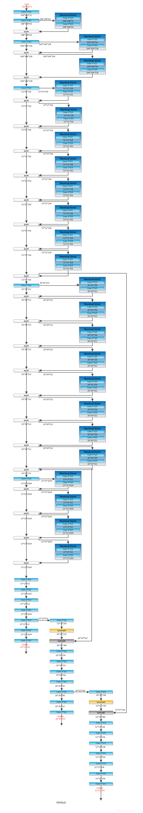
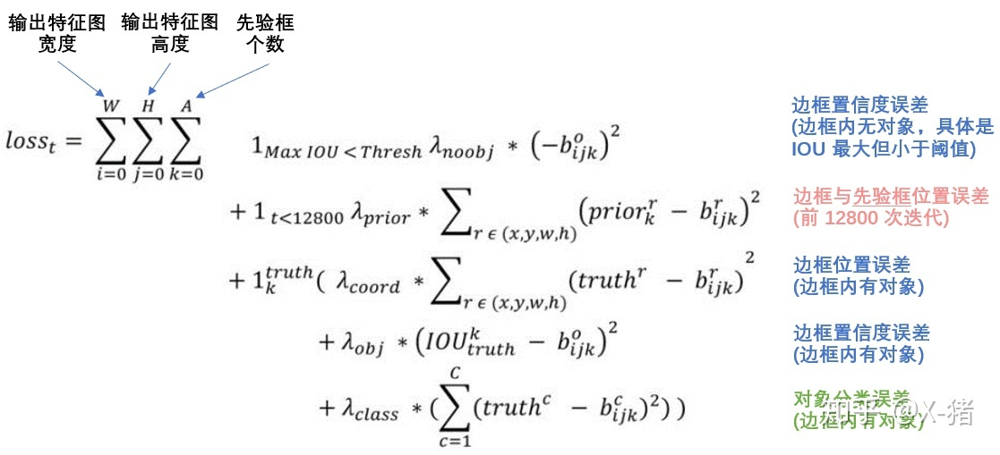

### 使用方法
    1. 查看requirement.txt文件查看环境是否正确。
       只需保证导入的库的正确，不用全不。
    2. 下载yolov3.weights文件 https://pjreddie.com/media/files/yolov3.weights
        保存在和image.py同路径下
        
    image_demo.py
    video_demo.py
    train.py

    3. 使用train.py文件前，先将A05(即图片)放在./data/下.

    在使用过程中出现路径不对的情况,请进行调整(可能的问题是os.path.abspath()获取的绝对路径不对)
    其次可能出现环境不对的情况。
    


### yolov3文件目录结构
- core #源程序
    - backbone.py  #骨干网络
    - common.py   #常用函数
    - config.py   #参数配置文件
    - dataset.py  #训练前的数据处理
    - utils.py
    - yolov3.py
- data  #存放相关训练数据
    - anchors  #预先设定的锚框
    - classes  #预先设置好分类
    - dataset  #存放Pascal vac格式的数据转化的txt文件形式
- docs
- image_demo.py  #单张图片的测试程序
- video_demo.py  #视频(摄像头)的测试程序
- kmaens.py   #获取先验框，存放在data/anchors下  
- train.py 训练文件  
- web_demo.py flask框架的网页显示本地版（未完成），可以试试
- yolov3.weights   #权重参数文件

---

### 详细说明

1. common.py
    定义函数：  
    BatchNormalization：批归一化(有助于解决反向传播过程中的梯度消失和梯度爆炸问题，降低对一些超参数的敏感性)   
    convolutional：卷积层封装  
    residual_block：残差结构  
    upsample：上采样  
    
2. backbone.py (引入common.py)

    backbone.py是yolov3的骨干网络

    图片说明：  
        1. 输入为416\*416\*3的RGB图片  
        2. Conv是简单的卷积层 
        3. Residual block是残差结构，目的提高网络的深度的同时不降低精度。  
        4. upsample是上采样。  
        5. concat是将两部分张量组合。  
        6. 最后输出三部分张量 13\*13\*255 / 26\*26\*255 / 52\*52\*255 ，这三部分分别代表了对原图大目标，中目标，小目标的识别.  
        13\*13\*255的张量中(1\*1\*255)对应原图中(32\*32\*3)的区域,以此推测。  
        255代表的数据：anchorbox的位置坐标 ( x , y , w , h ) ，置信度(代表该先验框中存在物体的概率) ，分类种类(进行独热编码,此处设置80种分类) ，因为原图深度为3，所以255=3\*(5+80).  
        7. backbone.py并未把下图网络结构完全构建。图中最下方蓝色部分将在yolov3.py的YOLOv3函数中完成  

    

3. config.py 

    通用格式：

    ```python
    from easydict import EasyDict as edict

    __C                           = edict()

    cfg                           = __C
    
    __C.YOLO                      = edict()
    
    __C.YOLO.CLASSES              = "./data/classes/coco.names"
    __C.YOLO.ANCHORS              = "./data/anchors/basline_anchors.txt"
    __C.YOLO.STRIDES              = [8, 16, 32]
    __C.YOLO.ANCHOR_PER_SCALE     = 3
    __C.YOLO.IOU_LOSS_THRESH      = 0.5
    ```

4. yolov3.py (引入tensorflow /numpy / core.utils / core.common / core.backbone / core.config)
    定义函数：  
    YOLOv3 ：完成后续yolov3网络构建，参照图片   
    decode ：计算先验框的(x,y,w,h),置信度，分类可能性(用Logistic代替)
    bbox_iou : IOU (Intersection over Union) 交并比计算  
    bbox_giou ：GIOU 与IOU相同都作为损失计算的衡量值   
    compute_loss ：损失函数计算 请参考网上该图  
    

5. utils.py   
    配置函数及其他需要的函数  
    >定义函数 ：  
    load_weights : 加载已训练好的权重(yolov3.weights)    
    read_class_names : 获取./data/classes中的分类数据  
    get_anchors ：获取在./data/anchors中先验框的数据   
    image_preprocess ：将原图片进行缩放使大小变为416*416*3   
    draw_bbox : 利用opencv将框画在图片或视频上    
    bboxes_iou : IOU (Intersection over Union) 交并比计算   
    nms ：非极大值抑制(筛选先验框)择得分最高的作为输出，与该输出重叠的去掉，不断重复  
    preprocess_boxes ：进一步筛选先验框  

6. dataset.py
    
        1.在训练前处理Pascal vac数据。
        2.配置训练用的迭代器  
        

   

---

### 其他说明   
1. ./data/anchors中存放的先验框数据，是通过k-mean聚类算法，将Pascal vac中已标记的框进行分类，预先选出9个框，加快后续误差计算的收敛。 

2. https://zhuanlan.zhihu.com/p/46691043  
    https://zhuanlan.zhihu.com/p/47575929  
    https://zhuanlan.zhihu.com/p/49556105

    这是关于yolov3的知识。
